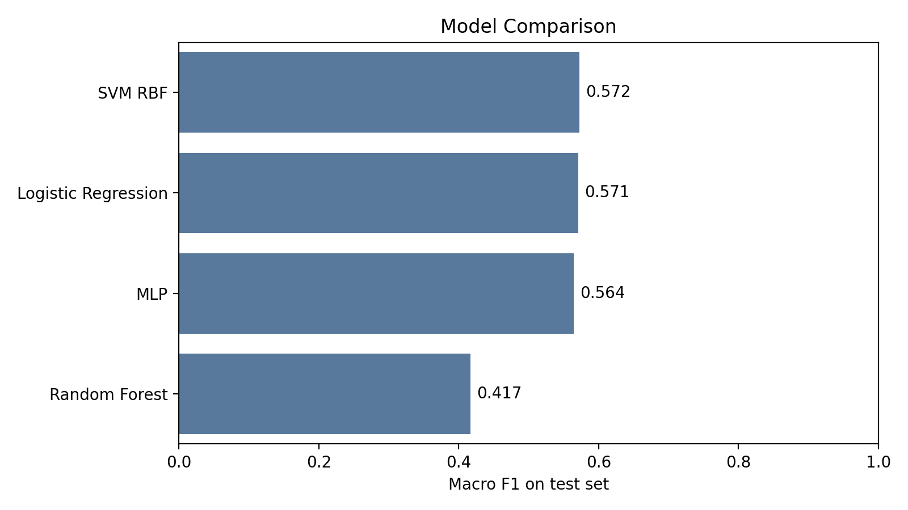
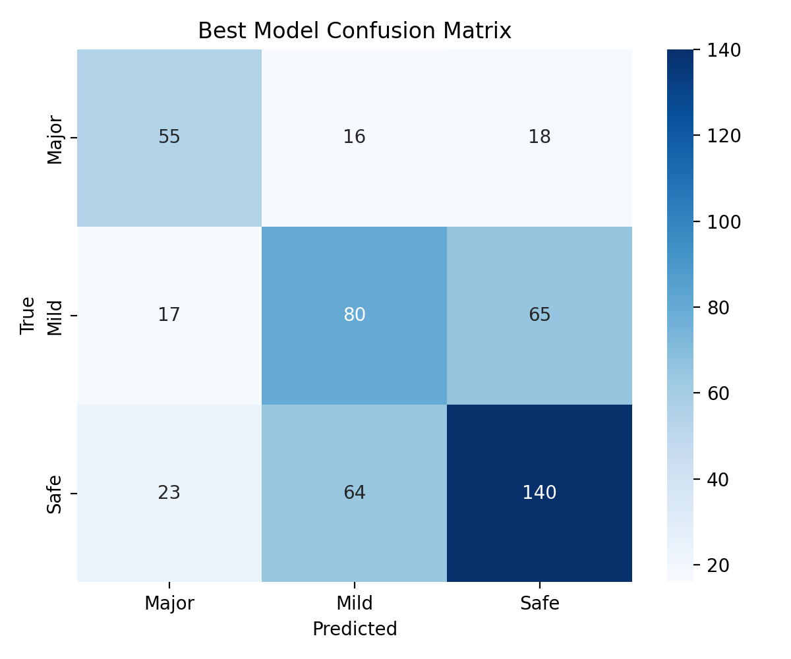

# Multi-Source Spoiler Detector

> A three-level movie-review spoiler classifier that detects whether text is safe, mildly spoiler-like, or a major spoiler.

[](https://huggingface.co/spaces/leoole/spoiler-detector)
[](https://huggingface.co/leoole/spoiler-detector)
[](https://huggingface.co/datasets/leoole/spoiler-detector)
[](https://www.python.org/)

## Overview

This project builds and deploys a spoiler severity detector for English movie reviews. Instead of a binary safe/spoiler decision, the model predicts three labels:

| Label | Meaning |
|---|---|
| `Safe` | No meaningful spoiler detected |
| `Mild` | Broad setup, tone, or non-critical plot information |
| `Major` | A key twist, death, identity, ending, solution, or final outcome is revealed |

The system uses IMDb reviews plus GPT-generated synthetic examples, sentence-transformer embeddings, and four classic classifiers. The final demo is deployed as a Hugging Face Space.

## Links

| Artifact | URL |
|---|---|
| Live demo | https://huggingface.co/spaces/leoole/spoiler-detector |
| Model repo | https://huggingface.co/leoole/spoiler-detector |
| Dataset repo | https://huggingface.co/datasets/leoole/spoiler-detector |

## Results

The best model on the held-out test set was an RBF-kernel SVM trained on normalized `all-mpnet-base-v2` embeddings.

| Model | Accuracy | Macro F1 | Weighted F1 |
|---|---:|---:|---:|
| SVM RBF | 0.5753 | 0.5723 | 0.5752 |
| Logistic Regression | 0.5669 | 0.5706 | 0.5661 |
| MLP | 0.5690 | 0.5640 | 0.5670 |
| Random Forest | 0.5314 | 0.4166 | 0.4434 |





## Method

The project pipeline has five stages:

1. Collect IMDb spoiler-review data and generate a smaller synthetic second source with GPT.
2. Clean, normalize, deduplicate, and merge all examples into a common schema.
3. Label IMDb spoiler reviews as `Mild` or `Major` with GPT, while assigning all non-spoiler rows to `Safe`.
4. Encode text with `sentence-transformers/all-mpnet-base-v2`.
5. Train and compare Logistic Regression, SVM, Random Forest, and MLP classifiers.

The manual annotation check sampled 100 Mild/Major rows and found **93% exact agreement** with the GPT severity labels.

## Data

The final dataset uses this schema:

| Column | Description |
|---|---|
| `text` | Review text |
| `source` | `imdb` or `gpt_synthetic` |
| `has_spoiler` | Binary spoiler flag |
| `severity` | `Safe`, `Mild`, or `Major` |
| `movie_id` | IMDb movie id when available |

Raw and processed CSV files are not stored in this GitHub repository. They are hosted in the Hugging Face dataset repository linked above.

## Project Structure

```text
spoiler-detector/
├── app/
│   └── app.py                  # Gradio demo
├── report/
│   ├── classification_report.txt
│   ├── test_results.csv
│   ├── validation_results.csv
│   └── figures/
│       ├── confusion_matrix.png
│       └── models_comparison.png
├── src/
│   ├── fetch_imdb.py
│   ├── generate_synthetic.py
│   ├── clean_data.py
│   ├── label_severity.py
│   ├── split_data.py
│   ├── embed_data.py
│   ├── train.py
│   └── evaluate.py
├── requirements.txt
└── README.md
```

## Run Locally

Create a Python 3.11 environment and install dependencies:

```bash
python3 -m venv venv
source venv/bin/activate
pip install -r requirements.txt
```

Launch the Gradio demo:

```bash
python app/app.py
```

The app loads `models/best_model.joblib` if it exists locally. If not, it downloads the model artifact from the Hugging Face model repository.

## Reproduce Training

The training pipeline can be reproduced with:

```bash
python src/fetch_imdb.py
python src/generate_synthetic.py
python src/clean_data.py
python src/label_severity.py
python src/split_data.py
python src/embed_data.py
python src/train.py
python src/evaluate.py
```

Some steps require API credentials in `.env`, especially `OPENAI_API_KEY` for GPT-based generation and severity labeling.

## Limitations

Spoiler severity is partly subjective, especially near the Mild/Major boundary. Synthetic reviews are useful for coverage but can differ stylistically from real user reviews. This project should be read as a transparent course-project prototype rather than a production moderation system.
